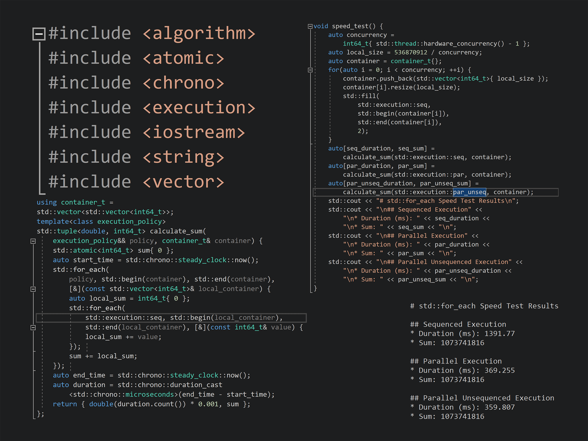

# C++ `std::for_each` Speed Test
 With the release of ISO C++17 Standard [https://www.iso.org/standard/68564.html], operations in `<algorithm>` header added support for policies provided in `<execution>` header. These policies include:
 * Sequenced
 * Parallel
 * Parallel Unsequenced

When appropriately implemented by compilers, operations like std::for_each will provide a simple way to perform multithreading and boost speed of processing large amounts of data (with an Intel i7-7820HK, our small code was almost 4x faster with parallel unsequenced execution). This repository contains an application for testing the speed of different execution policies.

## Compiler Requirements
| MSVC | GNU | Clang | Intel |
| ---- | --- | ----- | ----- |
| 15.4 v14.11 or above | TODO | TODO | TODO | 

## How to Use
1. Open command prompt with git
2. Type `git clone https://github.com/OguzDerin/cpp_std_for_each_speed_test.git`
3. Generate using your CMake workflow
   * **Visual Studio 2017+**: Enter the folder, right click, choose "Open in Visual Studio" and you are ready to go!

## To Do
* Enable C++17 using compiler options and definitions for compilers other than MSVC (help would be appreciated)
* Update when new execution policies added

